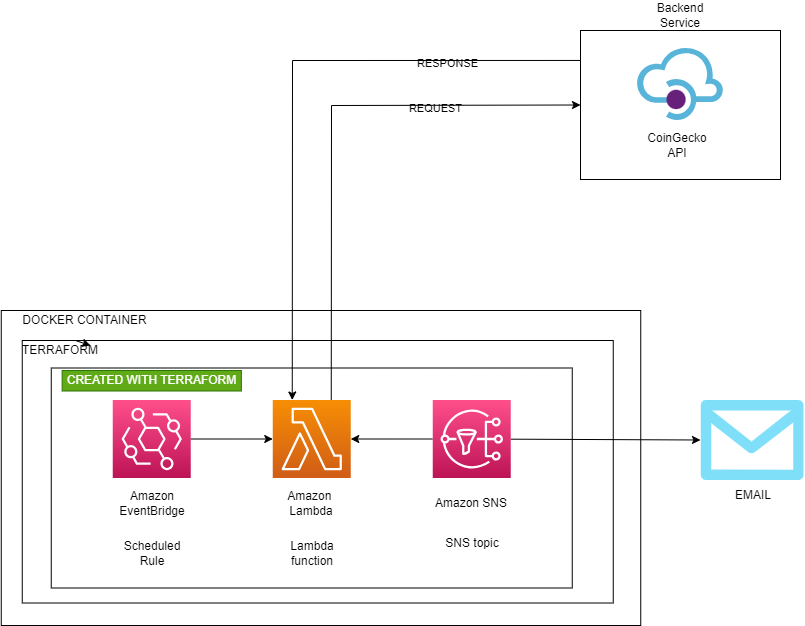

# Cryptocurrency Notifications Alert System 

This project is an AWS Notification System that uses AWS Lambda and an external API to fetch cryptocurrency data and send notifications via Amazon SNS.

## Table of Contents

- [Cryptocurrency Notifications Alert System](#cryptocurrency-notifications-alert-system)
  - [Table of Contents](#table-of-contents)
  - [Overview](#overview)
  - [Architecture Diagram](#architecture-diagram)
- [Project Structure](#project-structure)
  - [Setup](#setup)
  - [Terraform](#terraform)
  - [Lambda Function](#lambda-function)
  - [License](#license)

## Overview 

The Cryptocurrency Notifications Alert System fetches cryptocurrency data from an external API and sends notifications about the cryptocurrencies' status, prices, and other details via Amazon SNS.

## Architecture Diagram


# Project Structure 

├── .env 
├── docker-compose.yml 
├── policies 
│ └── gd_notifications.json 
├── src │ 
├── coins.txt │ 
├── lambda_function.py 
│ └── lambda_function.zip 
├── main.tf 
├── terraform.tfvars 
└── README.md

## Setup

1. **Clone the repository:**
    ```sh
    git clone <repository-url>
    cd Game-Notification-with-AWS-Lambda-Amazon-SNS-and-AmazonBridge
    ```

2. **Create a zip of the Lambda Function:**
    - Package the Lambda function code:
        ```sh
        cd src
        zip lambda_function.zip lambda_function.py coins.txt
        ```

3. **Add Environment Variables:**
    - Create a [.env](http://_vscodecontentref_/1) file in the root directory with the following content:
        ```properties
        API_KEY=your_api_key
        AWS_ACCESS_KEY_ID=your_aws_access_key_id
        AWS_SECRET_ACCESS_KEY=your_aws_secret_access_key
        AWS_ACCOUNT_ID=your_aws_account_id
        AWS_REGION=your_aws_region
        AWS_TOPIC=crypto_notifications
        ```
4. **Create [terraform.tfvars](http://_vscodecontentref_/3) for variables:**
    - Create a [terraform.tfvars](http://_vscodecontentref_/4) file in the root directory with the following content:
        ```properties
        region = "your_aws_region"
        account_id = "your_aws_account_id"
        topic = "crypto_notifications"
        ```

## Terraform

The Terraform configuration is used to provision the necessary AWS resources, including the IAM role, SNS topic, and Lambda function. The configuration files are located in the root directory of the project.

1. **Initialize Terraform:**
    ```sh
    docker-compose run terraform_container init
    ```

2. **Apply the Terraform configuration:**
    ```sh
    docker-compose run terraform_container apply -auto-approve
    ```

3. **Destroy the Terraform-managed infrastructure (if needed):**
    ```sh
    docker-compose run terraform_container destroy -auto-approve
    ```

## Lambda Function

The Lambda function fetches cryptocurrency data from the CoinGecko API and sends notifications via Amazon SNS. The function reads a list of cryptocurrency IDs from the `coins.txt` file and fetches data for each cryptocurrency.

## License

This project is licensed under the MIT License. See the [LICENSE](http://_vscodecontentref_/2) file for details.
